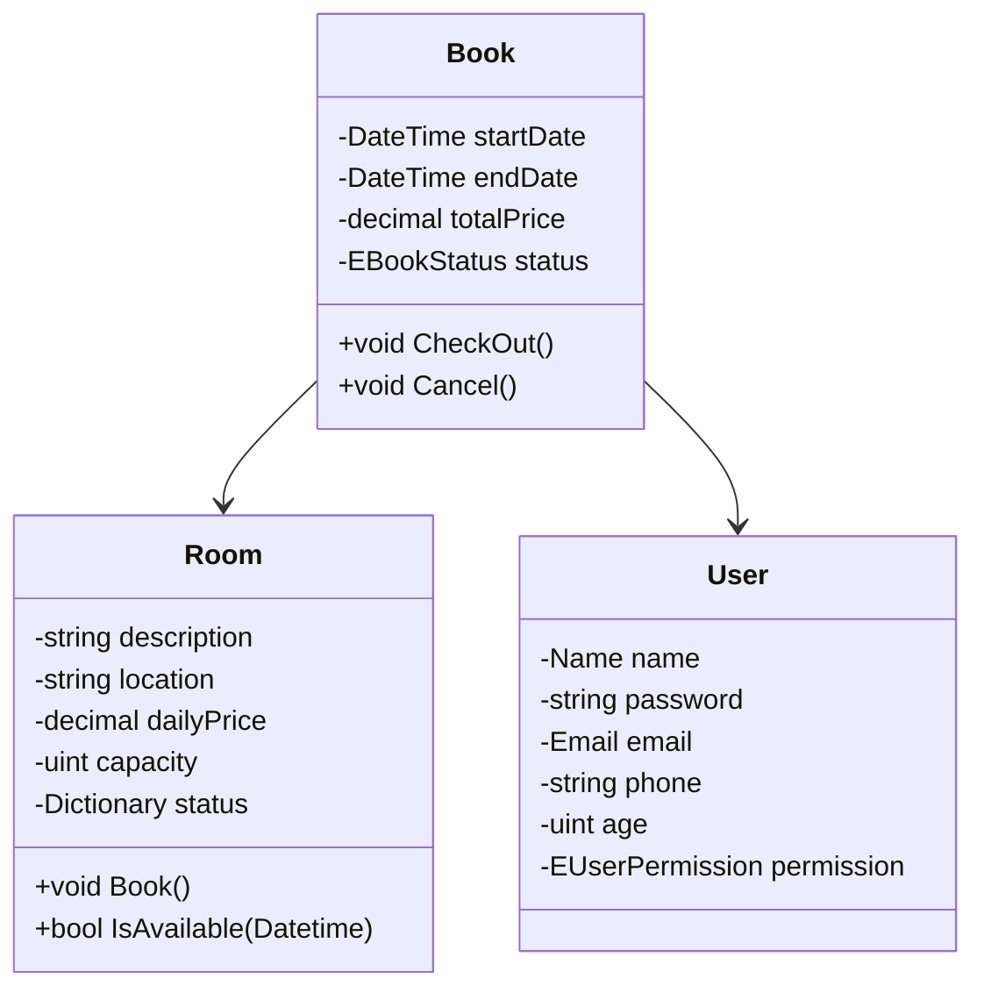

## Sobre o projeto "EliteStay"

### Motivação

* Meu objetivo principal ao desenvolver esta API foi tentar aplicar o máximo de conceitos possíveis de modo a demonstrar meu conhecimento (e também praticá-los) no desenvolvimento da aplicação como um todo.

* Qualquer dúvida sobre o projeto ou dificuldade para executá-lo, não hesite em me contatar. Meu email é rafa.rsouz@gmail.com. Você também pode me contatar via [Linkedin](https://www.linkedin.com/in/rafaelrsz/).
### Tema

*  O tema escolhido para API foi o de um serviço de hotelaria, minha escolha se deve ao motivo que o tema me permitiria desenvolver uma API que também contesse algumas regras de negócio, como não permitir duas reservas para um mesmo quarto na mesma data, etc.

* Além disso o tema me permitiria implementar pontos importantes de uma API como autorização via token e segurança de dados como senhas.

  

### Banco de dados

* Para acesso a dados, utilizei a biblioteca Dapper com procedures desenvolvidas manualmente por ser mais leve e adequado para um projeto pequeno como este, comparando com o EntityFramework Core. Além disso o Dapper me permitiu demonstrar meus conhecimentos em banco de dados escrevendo as querys a mão.

* Note que não utilizei mapeamento de entidades para criar um banco automaticamente, essa escolha foi intencional de modo a evitar problemas de configuração no banco.

  

### Versão .Net

* O Projeto foi desenvolvido na versão 7.0.306 do .Net Core, recomendo que verifique a versão instalada e, se preciso, instale a ultima versão disponível para executar o projeto.

  
  
  

## Instruções para teste

### Para conseguir executar o projeto, siga as seguintes instruções:

1. Faça o download do zip do projeto ou execute:

```bash

git clone https://github.com/rafaelrsz/elitestay.git

cd elitestay

```

  

2. Abra o Sql Manager de sua preferência e crie o banco de dados. Para o Sql Server recomendo o Sql Server Management Studio.

```sql

create database elitestay

```

  

3. Após criar o banco, vá na pasta do projeto e procure pelo arquivo *"create_db_pcs.sql"* que está localizado em *"EliteStay.Infra/Scripts"*, ele será o responsável por criar as tabelas e as procedures.

   * Note que este é um arquivo gerado automaticamente pelo SqlServer, você pode encontrar todos scripts feitos por mim na mesma pasta "scripts".
  

  
  

4. Execute o arquivo *"create_db_pcs.sql"*.

  

5. Após criar o banco de dados, é preciso alterar a ConnectionString do projeto. Para fazer isso, procure pelo arquivo *"Settings.cs"*, ele está localizado na pasta *"EliteStay.Shared"*.

  

6. Altere a ConnectionString para o seguinte formato de acordo com sua instância SqlServer e as informações de acesso da instância usuario e senha:

  

```C#

@"Server=[NOMEINSTANCIA];Database=elitestay;User ID=[USUARIO];Password=[SENHA];";

```

  

7. Agora na pasta raiz do projeto execute os seguintes comandos:

  * *"dotnet restore"* para baixar as dependências do projeto

  * *"dotnet build"* para compilar o projeto

  *  (Opcional) *"dotnet test"* para rodar os testes

  * *"dotnet run --project EliteStay.Api"* para executar o projeto

```bash

dotnet restore

dotnet build

dotnet test

dotnet run --project EliteStay.Api

```

  

8. Prontinho! A API estará rodando na porta *"http://localhost:5296"*. Para acessar sua documentação, acesse *"http://localhost:5296/swagger/index.html"*.

  

## Documentação

### API

* A API foi documentada utilizando o conjunto de ferramentas Swagger através do gerador SwashBuckle do .Net. A documentação pode ser acessada em *"http://localhost:5296/swagger/index.html"*.

  

### Diagrama de classes das entidades



### Testes de unidade
* Durante o desenvolvimento da API, implementei vários testes de unidade de modo a garantir o bom funcionamento da aplicação. Eles podem ser executados através do comando *"dotnet test"*.
```bash
dotnet test
```
